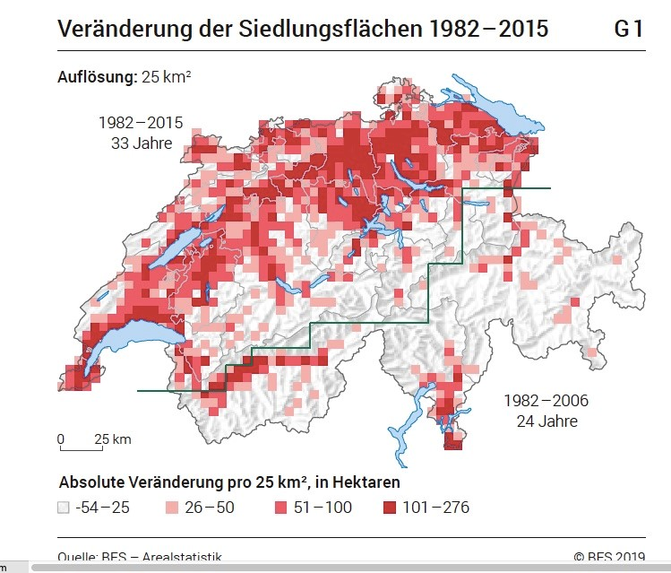
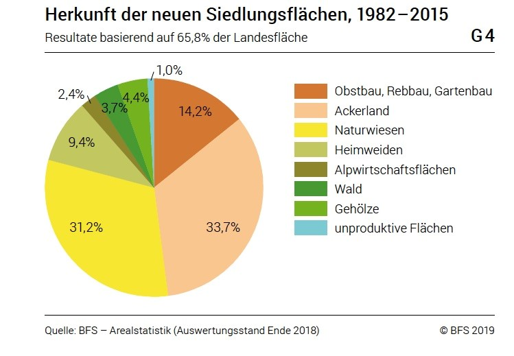
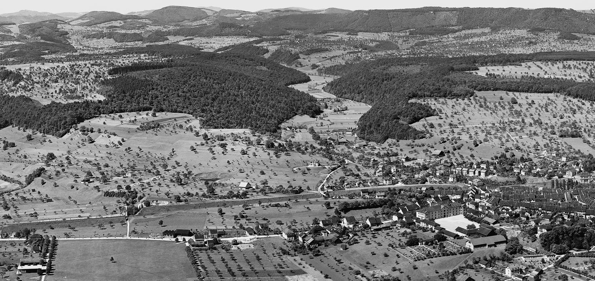
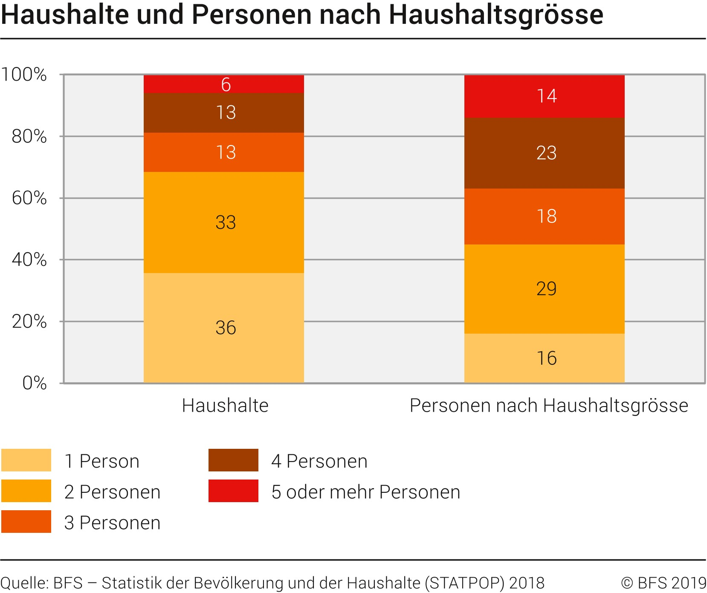
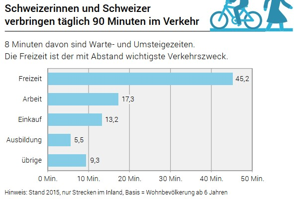
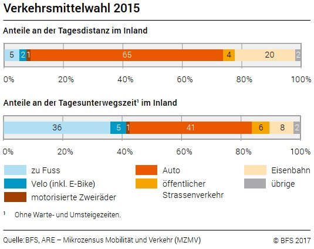
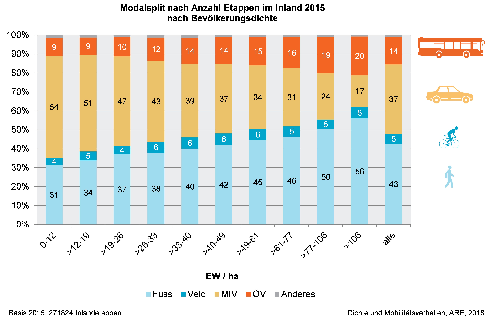

# Kapitel 1 Die Ressource Boden

**_In den letzten Jahrzehnten gingen in der Schweiz täglich rund neun Hektar Kulturland verloren, das ist rund ein Quadratmeter pro Sekunde. Etwa zwei Drittel davon werden neu als Siedlungsflächen genutzt. Beim Rest handelt es sich grösstenteils um aufgegebene Wiesen und Weiden, auf denen allmählich Wald aufkommt. Eine wichtige Rolle der Raumplanung ist es mitzuhelfen, diesen Kulturlandverlust zu verhindern. Die Ansprüche an die knappe Ressource Boden sind vielfältig._**

## 1.1 Entwicklung der Bodennutzung

Die Ressource Boden ist in der Schweiz ein kostbares Gut. Das Land weist eine Gesamtfläche von 41'285 km2 auf. Davon sind etwa ein Viertel unproduktive Flächen (Fels, Eis, Gewässer etc.). Ein knappes Drittel ist Wald und etwas mehr als ein Drittel sind landwirtschaftliche Nutzflächen (Wies- und Ackerland, Alpwiesen, Obst- und Rebbau etc.). Statistisch werden rund acht Prozent der Gesamtfläche zur Siedlungsfläche gezählt. Dazu gehören Gebäudeareale, Industrie- und Gewerbeareale, Verkehrsflächen, Erholungs- und Grünanlagen sowie besondere Siedlungsflächen wie Deponien oder Gebiete für den Kiesabbau.[\[1\]](#footnote-1)

Als besiedelbare Flächen gelten lediglich etwas mehr als 30 Prozent der gesamten Landesfläche. Dazu zählen die Siedlungsflächen und die landwirtschaftlichen Nutzflächen, ohne die alpwirtschaftlichen Maiensässe, Bergwiesen und Alpweiden. Auf diesem knappen Drittel spielt sich das Leben in der Schweiz mehrheitlich ab. Den Boden nutzen wir für das Wohnen und Arbeiten, für unsere Mobilität, für Versorgungs- und Entsorgungseinrichtungen, für gewerbliche und landwirtschaftliche Produktion sowie für die Erholung.

*Abbildung 1: Hauptsächlich im Mittelland, in einem Streifen vom Genfersee bis zum Bodensee, sowie in den Talböden des Wallis und des Tessins haben sich die Siedlungsflächen in den letzten Jahrzehnten ausgedehnt.*

Quelle: BFS, 2019, Landschaft Schweiz im Wandel - Siedlungsentwicklung, Neuenburg, S. 1

Die Siedlungsfläche der Schweiz hat sich seit 1950 gut verdoppelt. In den letzten 70 Jahren wurde also mehr gebaut als in der gesamten Siedlungsperiode zuvor. Das Siedlungswachstum muss jedoch räumlich differenziert werden: In den letzten Jahrzehnten nahm die Siedlungsfläche insbesondere im Mittelland sowie in den Talböden des Wallis und des Tessins stark zu. Genau in diesen Gebieten liegen auch die besten Ackerböden der Schweiz (> Abbildung 1).

Mit der Ausdehnung der Siedlungsflächen wurden in den letzten Jahrzehnten verschiedene wertvolle land- und forstwirtschaftliche Nutzflächen überbaut. Sind diese erst einmal verloren, kann dieser Verlust nicht mehr rückgängig gemacht werden (>Abbildung 2).

*Abbildung 2: Wohn- und Gewerbebauten, Einkaufs- und Logistikzentren, aber auch Sportanlagen und Strassen entstanden vorwiegend auf Ackerland und Wiesen.*

Quelle: BFS, 2019, Landschaft im Wandel - Siedlungsentwicklung, Neuenburg, S. 3

Zur Siedlung zählen statistisch nicht nur versiegelte Flächen. Neben Verkehrs- und Gebäudearealen gehören auch deren Umschwung sowie die Erholungs- und Grünanlagen dazu. In diesen Umgebungsflächen steckt - wie in den Grünanlagen - viel ökologisches Potenzial, das noch lange nicht ausgeschöpft ist.

Die neusten, noch unvollständigen Zahlen der Arealstatistik zeigen, dass sich das Siedlungswachstum verlangsamt hat, dass die Siedlungen oft dort wachsen, wo auch die Bevölkerung zunimmt, und dass ein Trend zu verdichtetem Wohnen zu verzeichnen ist. Es sieht so aus, als ob raumplanerische Bemühungen, wie sie mit der Teilrevision des Raumplanungsgesetzes (RPG) 2012 eingeleitet wurden, langsam Wirkung zeigten.

Seit den 1980er-Jahren hat aber auch die Waldfläche um rund 4 Prozent zugenommen.[\[2\]](#footnote-2) Von dieser Entwicklung sind v. a. die Zentralalpen und die Alpensüdflanke (Wallis, Tessin) betroffen, wo die Alpweiden nicht länger bewirtschaftet werden.

### Vorher - nachher - Bild Liestal: Aktualisierung durch RR

## 1.2 Bevölkerung und Wohnen

Die Ursachen für den massiven Bodenverbrauch der letzten Jahrzehnte sind vielfältig. Mitverantwortlich sind neben der Bevölkerungszunahme auch wirtschaftliche, technische und gesellschaftliche Veränderungen. Betrachtet man die Wachstumskurven von Bevölkerung und Siedlungsflächenverbrauch, fällt auf, dass diese nicht parallel verlaufen. Die verbesserte Wirtschaftslage und der Trend zu Kleinhaushalten bewirkten, dass das Wachstum der Siedlungsflächen prozentual höher ausfiel als das Bevölkerungswachstum. Damit nahm die Siedlungsfläche pro Person in den letzten Jahren kontinuierlich zu. In seiner «Strategie Nachhaltige Entwicklung» von 2002 strebte der Bundesrat an, die Siedlungsfläche pro Einwohnerin und Einwohner auf 400 m2 zu beschränken (Stand 2009: etwa 407 m2 pro Person[\[3\]](#footnote-3)). Heute beträgt der Flächenverbrauch in städtischen Kantonen zwischen 140 und 300 m2 und in ländlichen sowie in Tourismuskantonen zwischen 500 und 830 m2.[\[4\]](#footnote-4)

Der Bodenverbrauch für das Wohnen hat in den letzten rund 40 Jahren um über 60 Prozent zugenommen*.[\[5\]](#footnote-5)* Vor rund hundert Jahren lebten noch mehr als 50 Prozent aller Menschen in der Schweiz in einem Grosshaushalt von fünf und mehr Personen. Heute sind es noch 14 Prozent. Fast 70 Prozent der Haushalte sind heute Kleinhaushalte mit ein bis zwei Personen. In den Städten ist dieser Anteil gar noch höher; in Zürich, Genf oder Locarno lag der Anteil der Einpersonenhaushalte 2018 bei 45 Prozent, in Basel und Lausanne bei rund 48 Prozent[\[6\]](#footnote-6) (> Abbildung 4). Gründe dafür sind u. a. die Alterung der Gesellschaft und die Individualisierung, aber auch der Anspruch der Wirtschaft an die räumliche Flexibilität der Mitarbeitenden.

*Abbildung 4: 2018 zählten 69 Prozent der Haushalte in der Schweiz zu den Kleinhaushalten mit ein bis zwei Personen.*

Quelle: BFS, 2019, Statistik der Bevölkerung und der Haushalte 2018, Neuenburg, /bfs/de/home/statistiken/bevoelkerung/stand-entwicklung/haushalte.html (Abfrage 26.8.2020)

Der Flächenbedarf für das Wohnen hat in den vergangenen Jahrzehnten nicht nur wegen der gesamthaft steigenden Zahl der Haushalte zugenommen. Als Folge des höheren Wohlstands leisten sich die Menschen in der Schweiz auch immer grössere Wohnungen. In den 1960/1970er-Jahren betrug die Fläche einer mittleren Neuwohnung 87 m2. Wohnungen, die nach 2000 erstellt wurden, weisen bereits eine durchschnittliche Fläche von 119 m2 auf, mittlere Einfamilienhäuser gar von 168 m2. Zusätzlich haben die Flächen der Wohnungen stärker zugenommen als die Zahl der Zimmer. Das bedeutet, dass der Komfort und die Qualität der Wohnungen gestiegen sind. Zudem gibt es immer mehr Zweit- und Ferienwohnungen. Der Wohnraumbedarf pro Kopf der Bevölkerung hat deshalb zwischen 1950 und 2018 von 24 m2 auf 46 m2 zugenommen. 2018 waren 57 Prozent der Gebäude mit Wohnnutzung Einfamilienhäuser. Darin wohnten aber nur 27 Prozent der Bevölkerung.[\[7\]](#footnote-7)

Die Bevölkerungsszenarien des Bundesamtes für Statistik (BFS) zeigen, dass die Wohnbevölkerung der Schweiz von 8,6 Millionen (Ende 2019) auf 10,4 Millionen im Jahr 2050 ansteigen wird. Grund dafür ist vorwiegend die Migration. Obwohl schon heute drei Viertel der in der Schweiz lebenden Menschen in Agglomerationen wohnen, wird erwartet, dass sich die Bevölkerung noch stärker in den Grossagglomerationen Zürich und Basel und im Genferseeraum konzentrieren wird. In Graubünden und im Tessin wird die Bevölkerung schrumpfen. In der Schweiz wird die Bevölkerung aber auch markant altern, weil die geburtenstarken Jahrgänge ins Pensionsalter kommen und die Lebenserwartung noch am Steigen ist.[\[8\]](#footnote-8)

## 1.3 Mobilität und Verkehr

Die Bevölkerung der Schweiz ist so mobil wie noch nie. Täglich verbringen Herr und Frau Schweizer durchschnittlich 90 Minuten im Verkehr[\[9\]](#footnote-9) und legen dabei 36,8 Kilometer zurück.[\[10\]](#footnote-10) Mit Abstand wichtigster Verkehrszweck ist die Freizeit (50 %der Unterwegszeit), gefolgt von der Arbeit (19 %), dem Einkaufen (15 %) und der Ausbildung (6 %) (>Abbildung 5).[\[11\]](#footnote-11)

*Abbildung 5: Der Freizeitverkehr macht mit 45 Minuten die Hälfte der Unterwegszeit aller Schweizerinnen und Schweizer aus.*

Quelle: BFS, 2020, Mobilität und Verkehr, Taschenstatistik 2020, Neuenburg, S. 2

65 Prozent der zurückgelegten Kilometer werden dabei mit dem Auto und 24 Prozent mit dem öffentlichen Verkehr bewältigt (>Abbildung 6).[\[12\]](#footnote-12) Der Langsamverkehr (Fussgängerinnen, Velofahrer) scheint eine untergeordnete Rolle zu spielen. Dieser Eindruck täuscht jedoch: Insgesamt fallen nämlich 41 Prozent der gesamten Unterwegszeit auf den Fuss- oder Veloverkehr. Damit wird deutlich, dass diesen Fortbewegungsmöglichkeiten in der Siedlungsentwicklung eine hohe Bedeutung zukommt, was umso mehr ins Gewicht fällt, als 46 Prozent aller Autofahrten kürzer als fünf Kilometer sind. Somit besteht ein wesentliches Potenzial für mehr Langsamverkehr.

*Abbildung 6: Nur 7 Prozent der Tagesdistanz werden zu Fuss oder mit dem Velo zurückgelegt. Das entspricht aber 41 Prozent der Zeit, während der die Bevölkerung unterwegs ist.*

Quelle: BFS, 2017, Verkehrsverhalten der Bevölkerung 2015, Neuenburg, S. 8

Ausdruck der heutigen Mobilität sind die zahlreichen verkehrsintensiven Vergnügungs- und Einkaufsmöglichkeiten ausserhalb oder am Rand bestehender Siedlungen, wofür umfangreiche Infrastrukturen wie grosse Verkehrsflächen und Parkplätze benötigt werden, die aus Kostengründen oft ebenerdig angeordnet sind. Bei den zu Vergnügungs- und Einkaufszwecken errichteten Gebäuden handelt es sich oft um grossflächige, eingeschossige Bauten und Hallen. Dies widerspricht nicht nur der sparsamen Bodennutzung, sondern wirkt sich auch in anderer Hinsicht negativ aus. Der verursachte Mehrverkehr führt zu erhöhten Lärm- und Luftbelastungen. Einkaufzentren konkurrenzieren den Detailhandel in den Gemeinden, was eine Entleerung der Dorf- und Stadtzentren sowie der städtischen Aussenquartiere zur Folge hat und lokal zu Versorgungsschwierigkeiten führt (> Ziff. 14.4).

Die Verkehrsflächen machten Ende 2015 knapp 30 Prozent der gesamten Siedlungsfläche der Schweiz aus. [\[13\]](#footnote-13) 88 Prozent der Verkehrsflächen fielen auf Strassen und Nebenanlagen, rund 10 Prozent auf die Bahnen. [\[14\]](#footnote-14)

## 1.4 Immobilien und Wirtschaft**

Auch der strukturelle Wandel der Wirtschaft hat den Raumbedarf beeinflusst. Ende des 19. und in der ersten Hälfte des 20. Jahrhunderts beanspruchte die produzierende Industrie sehr viel Land. In den letzten Jahrzehnten verlagerten sich die wirtschaftlichen Aktivitäten in den tertiären Sektor, und in neuster Zeit entwickeln sie sich Richtung Digitalisierung (Industrie 4.0) weiter. Heute konzentriert sich die Wirtschaft bevorzugt auf die dicht besiedelten oder verkehrsmässig gut erschlossenen Räume der Schweiz. Zum Wohnen suchte man demgegenüber oft ruhige Lagen im Grünen, abseits von Verkehr und Umweltbelastungen. Die räumliche Entmischung zwischen Wohnen und Arbeiten nahm in den letzten Jahrzehnten zu. Begünstigt wurde die Entwicklung durch die massiv ausgebaute und verbesserte Verkehrsinfrastruktur, etwa durch den Ausbau des Nationalstrassennetzes oder die Einführung und den Ausbau der S-Bahn.

Nicht nur die bessere Verkehrsinfrastruktur treibt den Immobilien- und Wohnungsbau an. Die aktuelle Tief- und Negativzinspolitik bewirkt, dass private und institutionelle Anleger ihr Geld in Immobilien investieren. In verschiedenen ländlichen Gebieten werden ungeachtet der Bevölkerungsprognosen Wohnungen gebaut, für die kaum Nachfrage besteht. In den grossen Städten zeigt sich dagegen ein Wohnungsmangel, bedingt durch ein starkes Bevölkerungswachstum, den knappen Boden sowie zeitaufwändige Planungs- und Umsetzungsprozesse.

Die Industrie- und Gewerbeareale der Schweiz machen etwa acht Prozent des Siedlungsgebiets aus. Ihr prozentualer Anteil an der Siedlungsfläche blieb in den vergangenen Jahren relativ stabil.[\[15\]](#footnote-15). Stark verändert hat sich dagegen die Anzahl der Industriebrachen. Im Jahr 2008 existierten schweizweit rund 350 aufgegebene Gewerbe- und Industrieareale, deren Fläche dem Gemeindegebiet der Städte Liestal oder Neuenburg entsprach.[\[16\]](#footnote-16) Viele von ihnen wurden seither zwischen- oder umgenutzt. Trotzdem zählte man 2017 schweizweit über 900 mögliche Transformationsareale mit einer Gesamtfläche von rund 5000 Hektar. Über 80 Prozent liegen in Zentren und suburbanen Gemeinden und damit an grundsätzlich marktwirtschaftlich interessanten Standorten.[\[17\]](#footnote-17) Zentral gelegene Brachen und Transformationsareale bedeuten für die betroffenen Orte eine grosse Chance. Sie ermöglichen es, neue Quartiere oder ganze Stadtteile innerhalb des überbauten Gebiets mit Grün- und Freiräumen, einem abgestimmten Nutzungsmix und einer optimalen Anbindung an den öffentlichen Verkehr zu schaffen.

In einem starken Umbruch befindet sich seit Jahrzehnten der Detailhandel. Dieser verlagerte sich zu einem wesentlichen Teil aus den Ortszentren in die Einkaufzentren und Supermärkte an den Rand der Siedlungen und immer stärker auch auf Onlineplattformen. Damit stellen sich den Gemeinden die Fragen, welche Bedeutung ihre Ortszentren heute und inskünftig haben werden, was mit unternutzten oder entleerten Einkaufszentren geschehen soll und wie die Logistik für den Onlinehandel räumlich gelöst werden kann.

## 1.5 Landwirtschaft und Kulturland**

Der zusätzliche Raumbedarf für Siedlung, Verkehr und Erholung erfolgte bis zum Inkrafttreten des revidierten Raumplanungsgesetzes RPG am 1. Mai 2014 fast vollständig auf Kosten des Kulturlandes (landwirtschaftlich nutzbarer Boden). Von 1982 bis 2015 entstanden rund 90 Prozent der neuen Siedlungsflächen auf Ackerland, Naturwiesen, Heimweiden oder Obst‑ und Rebbauflächen (> Abbildung 2).[\[18\]](#footnote-18) Hauptsächlich im Mittelland und in den Talböden der Berggebiete gingen für die Landwirtschaft zahlreiche der wertvollsten Anbauflächen, die sogenannten Fruchtfolgeflächen (> Ziff. 4.3), verloren.

Gesamthaft liegt über ein Drittel sämtlicher Siedlungsflächen ausserhalb jener Gebiete, die nach Bundesrecht als Bauzonen ausgeschieden sind (> Ziff. 7.4.3.1).[\[19\]](#footnote-19) In diesem Nichtbaugebiet nahm die Zahl der Bauten in der Vergangenheit stetig zu. Über die ganze Schweiz betrachtet liegen rund 66 Prozent sämtlicher Verkehrsflächen und 20 Prozent aller Bauten und Anlagen im Nichtbaugebiet. Das entspricht rund 595'000 Gebäuden. Rund 193'000 von ihnen weisen eine Wohnnutzung auf. 2018 wohnten rund 430'000 Personen und damit 5 Prozent der Schweizer Bevölkerung ausserhalb der Bauzone.[\[20\]](#footnote-20)

Weit über die Hälfte aller Gebäude ausserhalb der Bauzone sind landwirtschaftlich genutzte Wohn- und Ökonomiebauten.[\[21\]](#footnote-21) Der zunehmende Flächenbedarf für landwirtschaftliche Bauten lässt sich u. a. auf den landwirtschaftlichen Strukturwandel (immer weniger und grössere Betrieben) sowie auf die Tierschutzgesetzgebung und die Hors-sol-Produktion zurückführen. Grössere und leistungsfähigere Fahrzeuge ermöglichen eine effizientere und schnellere Bewirtschaftung der ausgedehnten Flächen, erfordern aber auch grössere Stellflächen sowie mehr Fläche für Wartung und Unterhalt. Für eine artgerechte Tierhaltung sind grössere Ställe notwendig. In vielen Regionen der Schweiz nimmt die witterungsgeschützte und bodenunabhängige Produktion von Gemüse und Früchten zu. Gewächshäuser und Folientunnel prägen ganze Landschaften.

Die intensive Bewirtschaftung setzt die landwirtschaftlichen Nutzflächen unter grossen Druck. Die maschinelle Verdichtung, der übermässige Eintrag von Düngemitteln und der Einsatz von Pestiziden strapazieren den Boden bzw. beeinträchtigen dessen Funktionen als Produzent von Nahrungsmitteln. Das RPG berücksichtigt in erster Linie diese Produktionsfunktion des Bodens sowie dessen Funktion als Träger von Bauten, indem es Baugebiet und Nichtbaugebiet trennt und die Siedlungsentwicklung nach innen vorschreibt. Dagegen fehlen heute eine einheitliche Definition der Bodenqualität oder eine landesweite Übersicht von Bodeninformationen und -daten.[\[22\]](#footnote-22)

## 1.6 Freizeit, Erholung und Tourismus

Freizeit, Gesundheit, Sport und Tourismus haben in unserer (Dienstleistungs-)Gesellschaft eine grosse Bedeutung. Aktivitäten im Freien und eine hohe Freiraumqualität wirken sich positiv auf das psychische und physische Wohlergehen der Erholungssuchenden aus.[\[23\]](#footnote-23) Zudem zählen attraktive Landschaften mit einer reichhaltigen Biodiversität und eine hohe Baukultur zum Fundament des Schweizer Tourismus.[\[24\]](#footnote-24)

Freizeitgestaltung und Tourismus beanspruchen jedoch Natur und Landschaft in zunehmendem Masse, ihre Bauten und Anlagen (Luftseil- und Sesselbahnen, Skilifte) hinterlassen deutliche Spuren in der Landschaft. Die natürlichen Ressourcen unserer meist öffentlich zugänglichen Erholungsräume werden zunehmend beansprucht; Ökosysteme werden vermehrt belastet, die Tierwelt wird gestört, Lärm und Abfall nehmen zu. Raumplanerisch besonders bedeutsam und oft konfliktträchtig sind die Auswirkungen sportlicher und touristischer Aktivitäten wie Golf, Mountainbiking, Klettern, Orientierungslauf, Heliskiing oder Seilparks. Die Auswertungen der Arealstatistik zeigen, dass die flächenmässige Zunahme bei den Erholungs- und Grünanlagen seit Jahrzehnten hoch ist. Von 1985 bis 2018 betrug sie rund 45 Prozent.[\[25\]](#footnote-25) Besonders zu diesem Wachstum beigetragen haben Golfplätze. Ihre Fläche hat in dieser Periode um 360 Prozent zugenommen.

Aus raum- und verkehrsplanerischer Sicht ist eine umsichtig geplante Förderung von attraktiven Frei- und Grünräumen innerhalb der Siedlungen und in Siedlungsnähe wichtig. Erholung, Sport- und Freizeitaktivitäten können so auch innerhalb oder in der Nähe des dichter werdenden Siedlungsgebiets stattfinden. Damit kann der Freizeitverkehr reduziert werden, der heute rund 50 Prozent des Personenverkehrs ausmacht[\[26\]](#footnote-26) (>Ziff. 1.3).

## 1.7 Natur und Landschaft

Die vielfältigen Landschaften der Schweiz, die sich durch ihre räumlichen Unterschiede auszeichnen, sind ein wichtiger Faktor für die Lebensqualität der Bevölkerung. Sie üben eine Anziehungskraft auf Menschen aus dem In- und Ausland aus und bilden die Lebensgrundlage für eine vielfältige Flora und Fauna. Die Landschaften der Schweiz sind Wohn-, Arbeits-, Erholungs-, Bewegungs-, Kultur- und Wirtschaftsraum in einem. Allerdings sind die Schweizer Landschaften einem raschen Wandel unterworfen. Sowohl die Landschaftsqualitäten als auch die Biodiversität sind unter Druck. 2018 war etwa die Hälfte aller Tier- und Pflanzenarten in der Schweiz gefährdet (> Abbildung 7)_.[\[27\]](#footnote-27)_

Infolge des Siedlungswachstums und des Ausbaus der Verkehrswege (> Ziff. 1.2 und 1.3) hat die Zerschneidung der Landschaft in den letzten Jahrzehnten stark zugenommen. Die zerschnittenen Flächen (Restflächen) erschweren die Vernetzung der Landschaften und der Ökosysteme. Diese Vernetzung ist jedoch notwendig, um einen Rückgang der Biodiversität und damit eine Abnahme der Artenvielfalt zu verhindern (> Ziff. 12.3). Biodiversität ist angewiesen auf eine Vielfalt an Ökosystemen und genetischen Arten sowie auf die Wechselwirkungen zwischen diesen. Mit Vernetzungskorridoren lassen sich unterschiedliche Ökosysteme - beispielsweise Naturschutzgebiete, extensiv genutzte landwirtschaftliche Flächen, Gewässerräume oder städtische Grün- und Freiräume - wieder miteinander verbinden. Auch der Wildwechsel kann dadurch gefördert werden. Heute sind etwa 12,5 Prozent der Landesfläche der Schweiz als Gebiete mit hoher Biodiversität ausgewiesen. 6,2 Prozent davon sind nationale Schutzgebiete, 3,1 Prozent sind auf kantonaler Ebene geschützt.[\[28\]](#footnote-28) Die Raumplanung kann mithelfen, die ökologische Infrastruktur weiter auszubauen und zu sichern.

*Abbildung 7: Fast die Hälfte aller untersuchten Tier- und Pflanzenarten in der Schweiz sind gefährdet.*

Quelle: ARE, 2018, Trends und Herausforderungen: Zahlen und Hintergründe zum Raumkonzept Schweiz, S. 35

Eine besondere räumliche Herausforderung stellt auch der Klimawandel dar. Die mittlere Jahrestemperatur ist in der Schweiz seit Messbeginn 1864 um 2 Grad Celsius gestiegen, gut doppelt so stark wie im globalen Mittel.[\[29\]](#footnote-29) Die Ursachen der Erwärmung müssen weltweit gemeinsam bekämpft werden. Bei Massnahmen, die der Erderwärmung und einem damit verbundenen Klimawandel entgegenwirken, spricht man von Klimaschutz. Neben der Senkung der Treibhausgase gehören auch Massnahmen zur Stärkung der Biodiversität und damit der Ökosysteme zum Klimaschutz. Parallel sind auch Massnahmen zur Anpassung an die bereits jetzt unvermeidlichen Folgen des Klimawandels nötig. Man spricht auch von der Klimaanpassung. Die Folgen des Klimawandels sind regional verschieden. Die Schweiz hat viel Erfahrung mit Naturgefahren und verfügt über erprobte Instrumente im Umgang mit Überschwemmungen, Murgängen oder Bergstürzen. Aktuell ist die Raum- und Stadtplanung mit neueren Phänomenen des Klimawandels konfrontiert, wie beispielsweise mit Hitzeinseln in den Städten. Grünräume und Bäume können ein Mittel sein, um sich an den Klimawandel anzupassen und die Folgen der Klimaerwärmung in der Stadt zu lindern. Bäume sind zudem in der Lage, einen wichtigen Beitrag zum Klimaschutz zu leisten, da sie aufgrund ihrer Speicherfähigkeit von Kohlendioxid zur Reduktion von CO2 in der Atmosphäre beitragen; je mehr Bäume es gibt, umso grösser ist der Lebensraum für die Fauna. Jeder Schritt hin zu mehr biologischer Vielfalt kann die Resilienz der Biosphäre erhöhen.

Die Situation der Fliessgewässer hat sich in den letzten Jahren stark verbessert. Dennoch sind rund 80 Prozent der Gewässer im Siedlungsgebiet in einem schlechten Zustand.[\[30\]](#footnote-30) Der Lebensraum einer Vielzahl von Tieren und Pflanzen ist beeinträchtigt. Gründe hierfür sind zahlreiche Verbauungen, der Eintrag von Nährstoffen und Pestiziden durch die Landwirtschaft und vermehrt auch die Auswirkungen des Klimawandels. Zudem bedroht der Siedlungsdruck wichtige Grundwasservorkommen.

Das im Jahr 2011 revidierte Gewässerschutzgesetzes (GSchG) verlangt, entlang der Fliessgewässer Gewässerräume auszuscheiden und so die natürlichen Funktionen der Gewässer zu gewährleisten (> Ziff. 7.4.3.4). Mit zahlreichen Renaturierungen konnten die Attraktivität der Gewässer für die Nutzerinnen und Nutzer erhöht und die Bedingungen für die Biodiversität verbessert werden, dennoch sind die Uferzonen und Feuchtgebiete noch immer zu fast 85 Prozent gefährdet.[\[31\]](#footnote-31)

**1.8 Siedlungsentwicklung nach innen**

Die vorgängigen Erläuterungen illustrierten die vielfältigen Ansprüche an die Ressource Boden und die nachteiligen Auswirkungen auf die Natur, die Umwelt und den Menschen durch die ungebremste Siedlungsentwicklung der letzten Jahrzehnte. Seit einigen Jahren (> Ziff. 2.2) findet ein Paradigmenwechsel statt: Die Siedlungen sollen nach innen wachsen und verdichtet werden. Neue Bauzonen sollen nur noch im Ausnahmefall ausgeschieden werden dürfen (> Ziff. 7.4.3.1).

Im Jahr 2017 waren in der Schweiz 2320 km2 Bauzonen ausgeschieden, was einer Fläche entspricht, die grösser ist als die Kantone Aargau und Solothurn zusammen. Liegen diese Bauzonen in zentrumsnahen Gemeinden und Städten, sind sie in der Regel dichter überbaut und damit im Sinne der Raumplanung haushälterischer genutzt. Zwischen 11 und 17 Prozent der Bauzonen waren 2017 noch nicht überbaut. Von raumplanerischem Interesse sind heute jene Bauzonenreserven in den zentrumsnahen Agglomerationsgürteln. Sie sind zu Fuss, mit dem Velo oder dem öffentlichen Verkehr gut erreichbar. Ausgedehnte Nutzungsreserven finden sich auch in vielen periurbanen und ländlichen Gemeinden, die eher peripher gelegen und daher mit dem öffentlichen Verkehr nur schlecht erschliessbar sind.[\[32\]](#footnote-32) In diesen Gemeinden sind die Bauzonen zum Teil überdimensioniert und müssen zurückgezont werden (Art. 15 Abs. 2 RPG).

Der öffentliche Verkehr ist für die Nutzerinnen und Nutzer attraktiv, wenn der Fahrplan dicht und die Verbindungen möglichst direkt sind. Je kompakter und urbaner die Siedlungsstrukturen sind, desto grösser sind die Anteile des öffentlichen sowie des Fuss‑ und Veloverkehrs (> Abbildung 8). Die Siedlungsentwicklung nach innen trägt somit dazu bei, öffentliche Verkehrsmittel attraktiver zu machen und deren Kostendeckungsgrad zu erhöhen.

Abbildung 8: Je dichter die Siedlung ist, desto weniger Wege werden mit dem Auto zurückgelegt. Dafür nimmt die Bedeutung des Fussverkehrs zu.

Quelle: ARE, 2018, Dichte und Mobilitätsverhalten, Bern, S. 15

Die Siedlungsentwicklung insgesamt, insbesondere auch die Grösse der Bauzonen, steuern Kantone und Gemeinden mit ihren raumplanerischen Instrumenten wie den Richtplänen (> Ziff. 5) und den Nutzungsplänen (> Ziff. 7). Diese Aufgabe wurde in der Vergangenheit wegen des fehlenden politischen Willens nur ungenügend wahrgenommen. Dies hat sich in den letzten Jahren geändert. Mit der Revision des Bundesgesetzes über die Raumplanung (RPG 1) wurden die raumplanerischen Instrumente und die inhaltlichen Anforderungen insbesondere im Bereich Siedlung geschärft. Die Ausführungen zum schweizerischen Planungssystem in den anschliessenden Kapiteln legen deshalb einen starken Fokus auf die Siedlungsentwicklung nach innen.

In der Raumplanung reicht es nicht, bloss die Veränderung der Boden- und Raumnutzung der Vergangenheit oder die aktuellen Zustände zu analysieren. Ebenso wichtig ist es, zukünftige Entwicklungen zu antizipieren und die kommenden räumlichen Herausforderungen in die Planung zu integrieren.

**1.9 Megatrends und ihre Auswirkungen auf die Raumentwicklung**

Mehrere übergeordnete Trends, sogenannte Megatrends, haben bedeutende Auswirkungen auf die Raumentwicklung der Schweiz. Zu ihnen zählen neben der Globalisierung und der Digitalisierung auch die Individualisierung, der Klimawandel und der demografische Wandel.[\[33\]](#footnote-33)

Die Megatrends bringen für Bund, Kantone und Gemeinden sowohl Herausforderungen als auch Chancen mit sich. So kann die Digitalisierung beispielsweise aktiv genutzt werden, um den Verkehr und die Mobilität besser zu steuern und raumplanerisch zu koordinieren. Dazu müssen die digitalen Basisinfrastrukturen auch in peripheren Räumen sichergestellt werden. Eine grosse Chance bietet auch die Industrie 4.0. Sie erlaubt es, die industrielle Produktion teilweise wieder in die Schweiz zurückzuholen (Reshoring) und neue Arbeitsplätze zu schaffen. Dagegen setzen das wirtschaftliche und demografische Wachstum, neue Formen der Mobilität (autonome Fahrzeuge) sowie die Industrialisierung der Landwirtschaft die Natur und die Landschaft tendenziell stärker unter Druck, weshalb zusätzliche Anstrengungen zum Schutz der Ökosysteme und der Biodiversität und damit auch zum Klimaschutz erforderlich werden. Weiter gilt es, die verschiedenen Akteure und die Bevölkerung für Fragen der Baukultur zu sensibilisieren. Die verstärkte Dynamik im Immobilienmarkt und die Verwendung internationaler Standards bringt immer mehr vom Gleichen und gefährdet die räumlichen Qualitäten der Schweiz mit ihrer grossen Vielfalt an Städten, Dörfern und anderen Siedlungsformen. Wie der Rat für Raumordnung in einem Bericht festhielt (siehe Kasten «Mehr zum Thema»), könnten bestimmte gut erschlossene Orte (z. B. in den alpinen Haupttälern oder entlang des Jurasüdfuss) zu neuen, urban ausgerichteten regionalen Zentren entwickelt werden, die einen Teil des Bevölkerungswachstums aufnehmen und dadurch die Metropolitanräume entlasten würden.

### Mehr zum Thema
[Rat für Raumordnung](https://www.are.admin.ch/de/rat-fuer-raumordnung-ror)

## Verweise
- Die vollständigen Ergebnisse der neusten Arealstatistik 2013/18 werden voraussichtlich 2021 veröffentlicht. Deshalb stützen wir uns in Kapitel 1 auf die älteren Arealstatistiken, auf die Teilergebnisse der Statistik 2013/18 basierend auf 66 Prozent und 83 Prozent der Landesfläche sowie auf daraus abgeleitete Schätzungen. [↑](#footnote-ref-1)

- BFS, Arealstatistik 2004/09 und Arealstatistik 2013/18 (Teilauswertung, basierend auf 66 bzw. 83 Prozent der Landesfläche) (z.T. nicht veröffentlichte Daten, vom BFS zur Verfügung gestellt). [↑](#footnote-ref-2)

- BFS, 2014, Siedlungsflächen pro Einwohner, Landschaft Schweiz im Wandel, Neuenburg (<https://www.bfs.admin.ch/bfs/de/home/statistiken/kataloge-datenbanken/publikationen.assetdetail.349691.html>; Abfrage vom 26.8.2020) [↑](#footnote-ref-3)

- BFS, 2019, Arealstatistik, Siedlungsflächen pro Einwohner, Kantone / Städte, Neuenburg. (<https://www.bfs.admin.ch/bfs/de/home/statistiken/raum-umwelt/bodennutzung-bedeckung/siedlungsflaechen/einwohner-arbeitsplatz.assetdetail.11007207.html>; Abfrage vom 1.9.2020) [↑](#footnote-ref-4)

- BFS, 2018, Arealstatistik 1979/85 - 2013/18, Neuenburg; Auswertung basierend auf 83 Prozent der Landesfläche) und gemäss eigener Berechnung. [↑](#footnote-ref-5)

- BFS, 2019, Statistischer Atlas der Schweiz, Einpersonenhaushalte 2018, Neuenburg. (<https://www.atlas.bfs.admin.ch/maps/13/de/14711_3033_3032_70/23355.html>; Onlineabfrage vom 26.8.2020) [↑](#footnote-ref-6)

- BFS, 2020, Bau- und Wohnungswesen 2018, Neuenburg, S. 9 ff. [↑](#footnote-ref-7)

- BFS, 2020, Bevölkerungsentwicklung von 2020 bis 2025: Medienmitteilung, Neuenburg. [↑](#footnote-ref-8)

- Mobilität und Verkehr sind keine Synonyme. Erstere umfasst die Möglichkeit und Bereitschaft von Menschen und Gütern, sich im Raum zu bewegen oder bewegt zu werden. Der zweitgenannte Begriff dagegen meint die tatsächlich umgesetzten und messbaren örtlichen Verschiebungen von Personen und Gütern. UVEK, 2017, Zukunft Mobilität Schweiz: UVEK-Orientierungsrahmen 2040, Bern, S. 7. [↑](#footnote-ref-9)

- BFS, 2017, Verkehrsverhalten der Bevölkerung 2015, Neuenburg, S. 6. [↑](#footnote-ref-10)

- Ebd., S. 10. [↑](#footnote-ref-11)

- Ebd., S. 8. [↑](#footnote-ref-12)

- BFS, 2019, Landschaft Schweiz im Wandel - Siedlungsentwicklung, Neuenburg, S. 4. [↑](#footnote-ref-13)

- Quelle: BFS, 2020, Mobilität und Verkehr, Taschenstatistik 2020, Neuenburg, S. 3 [↑](#footnote-ref-14)

- BFS, 2018, Arealstatistik 2013/2018 (vorläufige Ergebnisse, nicht veröffentlicht), Neuenburg [↑](#footnote-ref-15)

- ARE, 2008, Die Brachen der Schweiz: Reporting 2008, Bern, S. 4. [↑](#footnote-ref-16)

- Fahrländer Partner AG, 2017, Neue Brachen im Überblick, Bern, S. 15. [↑](#footnote-ref-17)

- BFS, 2019, Landschaft Schweiz im Wandel - Siedlungsentwicklung, Neuenburg, S. 3. [↑](#footnote-ref-18)

- Bauzone und Siedlungsfläche sind nicht das Gleiche. Die Siedlungsfläche nach Arealstatistik (siehe Ziff. 1.1) ist eine statistische Grösse. Diese stellt die konkrete Nutzung des Bodens fest und umfasst Gebäudeareale, Industrie- und Gewerbeareale, Verkehrsflächen, besondere Siedlungsflächen (wie Infrastrukturanlagen, Brachen oder Deponien) sowie Erholungs- und Grünanlagen. Bauzone ist ein raumplanerischer Begriff. Er beschreibt eine im Nutzungsplan scharf definierte Fläche, die nach Bundesrecht bebaut werden kann (siehe Ziff. 7.4.3.1). [↑](#footnote-ref-19)

- ARE, 2019, Monitoring Bauen ausserhalb der Bauzone - Standbericht 2019, Bern, S. 3. [↑](#footnote-ref-20)

- Ebd., S. 11. [↑](#footnote-ref-21)

- ARE/BAFU, 2020, Integration von Informationen zur Bodenqualität in der Raumplanung, Synthesebericht, Bern S. 11-15, 31-32. [↑](#footnote-ref-22)

- UVEK/BAFU, 2010, Amtsstrategie Sport + Tourismus 2010-2012, Bern, S. 2-3. [↑](#footnote-ref-23)

- BAFU, 2020, Erläuterungsbericht Landschaftskonzept Schweiz: Landschaft und Natur in den Politikbereichen des Bundes, Bern, S. 31. [↑](#footnote-ref-24)

- BFS, 2019, Arealstatistik 2013/2018, Neuenburg (Zwischenauswertung; 83 Prozent der Gesamtfläche der Schweiz) [↑](#footnote-ref-25)

- BFS, 2019, Mobilität und Verkehr, Taschenstatistik, Neuenburg, S.2. [↑](#footnote-ref-26)

- ARE, 2018, Trends und Herausforderungen: Zahlen und Hintergründe zum Raumkonzept Schweiz, S. 35. [↑](#footnote-ref-27)

- Schweizerischer Bundesrat, 2018, Umwelt Schweiz 2018: Bericht des Bundesrats*,* S.101. [↑](#footnote-ref-28)

- Ebd., S. 82. [↑](#footnote-ref-29)

- Ebd., S. 68. [↑](#footnote-ref-30)

- Schweizerischer Bundesrat, 2018, Umwelt Schweiz, Bern, S. 100. [↑](#footnote-ref-31)

- ARE, 2017, Bauzonenstatistik Schweiz 2017: Statistik und Analysen, S. 32. [↑](#footnote-ref-32)

- Rat für Raumordnung (ROR), 2019, Megatrends und Raumentwicklung Schweiz, Bern, S. 25-37. [↑](#footnote-ref-33)